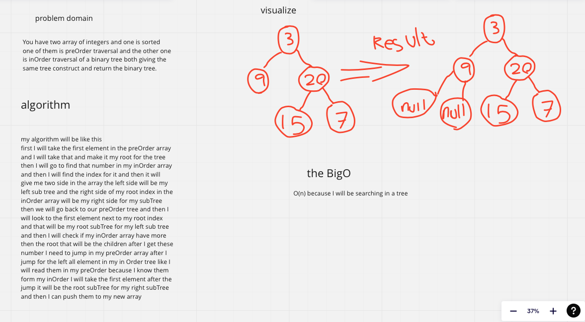

### problem domain

You have two array of integers and one is sorted
one of them is preOrder traversal and the other one is inOrder traversal of a binary tree both giving the same tree construct and return the binary tree.

